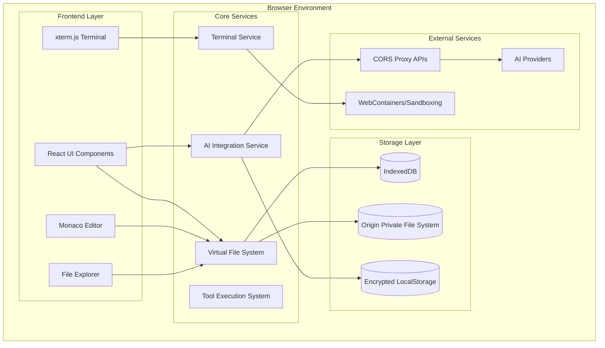

# ThinkBackCode - Technical Architecture

## 🏗️ System Overview

ThinkBackCode is a browser-based IDE that provides a complete development environment with AI-powered assistance. The architecture is designed to be modular, extensible, and performant while running entirely in the browser.

## 📐 High-Level Architecture



## 🎯 Core Components

### 1. Frontend Layer

#### React UI Framework
- **Technology**: Next.js 15 with App Router
- **Styling**: Tailwind CSS with custom components
- **State Management**: React Context + useReducer
- **Routing**: Next.js App Router for SPA experience

#### Monaco Editor Integration
```typescript
interface EditorService {
  // Core editor functionality
  createEditor(container: HTMLElement, options: EditorOptions): IStandaloneCodeEditor
  setModel(editor: IStandaloneCodeEditor, model: ITextModel): void
  
  // File integration
  openFile(path: string): Promise<ITextModel>
  saveFile(model: ITextModel): Promise<void>
  
  // AI integration
  registerCompletionProvider(provider: CompletionProvider): void
  registerCodeActionProvider(provider: CodeActionProvider): void
}
```

#### Terminal Integration
```typescript
interface TerminalService {
  // Terminal management
  createTerminal(container: HTMLElement): Terminal
  executeCommand(command: string): Promise<CommandResult>
  
  // File system integration
  setWorkingDirectory(path: string): void
  getWorkingDirectory(): string
  
  // Process management
  killProcess(pid: number): void
  listProcesses(): Process[]
}
```

### 2. Virtual File System

#### File System Abstraction
```typescript
interface VirtualFileSystem {
  // Basic operations
  readFile(path: string): Promise<string>
  writeFile(path: string, content: string): Promise<void>
  deleteFile(path: string): Promise<void>
  renameFile(oldPath: string, newPath: string): Promise<void>
  
  // Directory operations
  readDirectory(path: string): Promise<FileEntry[]>
  createDirectory(path: string): Promise<void>
  deleteDirectory(path: string, recursive?: boolean): Promise<void>
  
  // Project operations
  importProject(zipFile: File): Promise<void>
  exportProject(): Promise<Blob>
  
  // Watching
  watchFile(path: string, callback: FileWatchCallback): Disposable
  watchDirectory(path: string, callback: DirectoryWatchCallback): Disposable
}
```

#### Storage Strategy
- **IndexedDB**: Structured file metadata, project information
- **OPFS**: Large file content, binary files
- **Memory Cache**: Frequently accessed files
- **Compression**: gzip compression for text files

### 3. AI Integration Layer

#### Provider System
```typescript
interface AIProvider {
  name: string
  models: string[]
  
  // Authentication
  authenticate(apiKey: string, baseUrl?: string): Promise<boolean>
  
  // Chat completion
  createChatCompletion(request: ChatCompletionRequest): Promise<ChatCompletionResponse>
  
  // Streaming
  createChatCompletionStream(request: ChatCompletionRequest): AsyncIterable<ChatCompletionChunk>
  
  // Tool calling
  supportsTools(): boolean
  executeToolCall(toolCall: ToolCall): Promise<ToolResult>
}
```

#### Supported Providers
- **OpenAI**: GPT-4, GPT-3.5-turbo
- **Anthropic**: Claude 3.5 Sonnet, Claude 3 Haiku
- **Google**: Gemini Pro, Gemini Flash
- **Local**: Ollama, LM Studio
- **Custom**: Any OpenAI-compatible endpoint
- **ThinkBackCode**: Native integration

#### Security Model
```typescript
interface APIKeyManager {
  // Storage
  storeKey(provider: string, key: string, encrypted?: boolean): Promise<void>
  retrieveKey(provider: string): Promise<string | null>
  deleteKey(provider: string): Promise<void>
  
  // Encryption
  encryptKey(key: string): string
  decryptKey(encryptedKey: string): string
  
  // Validation
  validateKey(provider: string, key: string): Promise<boolean>
}
```

### 4. Tool System

#### Tool Architecture
```typescript
interface Tool {
  name: string
  description: string
  parameters: ToolParameters
  
  execute(parameters: any, context: ToolContext): Promise<ToolResult>
}

interface ToolContext {
  fileSystem: VirtualFileSystem
  terminal: TerminalService
  editor: EditorService
  workspace: WorkspaceService
}
```

#### Core Tools
- **File Operations**: read_file, write_file, create_file, delete_file
- **Directory Operations**: list_files, create_directory, delete_directory
- **Search**: search_files, find_in_files, grep
- **Code Analysis**: get_symbols, find_references, get_diagnostics
- **Terminal**: execute_command, run_script
- **Git**: git_status, git_commit, git_push, git_pull
- **Browser**: open_url, screenshot, interact_with_page

### 5. Terminal Execution Environment

#### WebContainers Integration
```typescript
interface ExecutionEnvironment {
  // Container management
  createContainer(): Promise<Container>
  destroyContainer(container: Container): Promise<void>
  
  // Command execution
  executeCommand(container: Container, command: string): Promise<CommandResult>
  
  // File system mounting
  mountFileSystem(container: Container, fs: VirtualFileSystem): Promise<void>
  
  // Process management
  listProcesses(container: Container): Promise<Process[]>
  killProcess(container: Container, pid: number): Promise<void>
}
```

#### Sandboxing Strategy
- **Isolated Execution**: Each project runs in isolated WebContainer
- **Resource Limits**: CPU, memory, and network restrictions
- **File System Access**: Limited to project directory
- **Network Access**: Controlled outbound connections only

## 🔧 Data Flow Architecture

### 1. File Operations Flow
```
User Action → UI Component → File System Service → Storage Layer → Update UI
                ↓
            Monaco Editor ← File Content ← Storage Layer
```

### 2. AI Interaction Flow
```
User Input → Chat Interface → AI Service → Provider API → Response Processing → UI Update
                                ↓
                          Tool Execution → File System/Terminal → Result → AI Context
```

### 3. Terminal Command Flow
```
User Command → Terminal UI → Terminal Service → WebContainer → Command Execution → Output → Terminal UI
                                ↓
                        File System Integration → Virtual File System → Storage Update
```

## 🚀 Performance Optimizations

### 1. Code Splitting
- **Route-based**: Separate bundles for different IDE sections
- **Component-based**: Lazy loading for heavy components
- **Dynamic imports**: Load providers and tools on demand

### 2. Virtual Scrolling
- **File Explorer**: Handle large directory structures
- **Editor**: Efficient rendering of large files
- **Terminal**: Manage long command output

### 3. Caching Strategy
- **File Content**: LRU cache for frequently accessed files
- **AI Responses**: Cache common completions and responses
- **Syntax Highlighting**: Cache parsed syntax trees
- **Search Results**: Cache search indices

### 4. Web Workers
- **File Processing**: Parse and index files in background
- **AI Processing**: Handle AI responses without blocking UI
- **Search Indexing**: Build search indices asynchronously

## 🔒 Security Architecture

### 1. API Key Security
- **Encryption**: AES-256 encryption for stored keys
- **Isolation**: Keys never exposed to global scope
- **Validation**: Server-side key validation when possible
- **Rotation**: Support for key rotation and expiration

### 2. Code Execution Security
- **Sandboxing**: All code execution in isolated containers
- **Resource Limits**: Prevent resource exhaustion attacks
- **Network Isolation**: Controlled network access
- **File System Isolation**: Limited file system access

### 3. Data Protection
- **Client-side Encryption**: Sensitive data encrypted before storage
- **Secure Transport**: HTTPS for all external communications
- **CSP Headers**: Content Security Policy for XSS protection
- **Input Validation**: Comprehensive input sanitization

## 📱 Progressive Web App Features

### 1. Offline Capability
- **Service Worker**: Cache critical resources
- **Background Sync**: Sync changes when online
- **Offline Editing**: Full editing capability offline
- **Conflict Resolution**: Handle sync conflicts gracefully

### 2. Installation
- **Web App Manifest**: Native app-like installation
- **Desktop Integration**: File association and protocol handling
- **Mobile Support**: Touch-optimized interface
- **Responsive Design**: Adaptive layout for all screen sizes

## 🔌 Extensibility Architecture

### 1. Plugin System
```typescript
interface Plugin {
  id: string
  name: string
  version: string
  
  activate(context: PluginContext): void
  deactivate(): void
  
  contributes: {
    commands?: Command[]
    tools?: Tool[]
    themes?: Theme[]
    languages?: LanguageSupport[]
  }
}
```

### 2. Theme System
- **CSS Variables**: Dynamic theme switching
- **Monaco Themes**: Editor theme integration
- **Component Themes**: UI component theming
- **Custom Themes**: User-defined theme creation

### 3. Language Support
- **Monaco Languages**: Built-in language support
- **Custom Languages**: Plugin-based language extensions
- **Syntax Highlighting**: TextMate grammar support
- **IntelliSense**: Language server protocol integration

---

This architecture provides a solid foundation for building a powerful, extensible, and secure browser-based IDE with AI capabilities.
